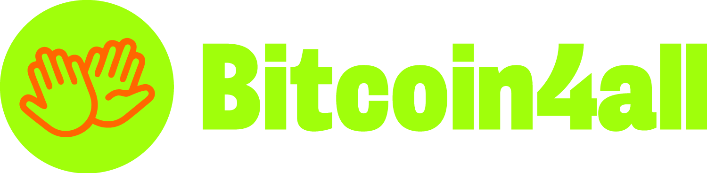

  

<h1 align="center">Bitcoin 4 All</h1>

  <strong>🎓 Curso gratuito e open source de Bitcoin para todos</strong>

  <a href="#-sobre">Sobre</a> •
  <a href="#-idiomas-disponíveis">Idiomas</a> •
  <a href="#-conteúdo-do-curso">Conteúdo</a> •
  <a href="#-materiais">Materiais</a> •
  <a href="#-como-usar">Como Usar</a> •
  <a href="#-contribuir">Contribuir</a>

  
  
  
  

  
  

---

## 📖 Sobre

**Bitcoin 4 All** é um curso gratuito e open source criado pela [Area Bitcoin](https://areabitcoin.com.br).

O objetivo é ajudar mais pessoas a entenderem Bitcoin e inspirar qualquer um a ser um multiplicador do conhecimento sobre Bitcoin. Qualquer pessoa, independentemente do seu nível de conhecimento ou formação, pode aprender e ensinar sobre essa tecnologia revolucionária de forma simples, direta e prática.

> 🚀 **Vai além de um simples curso.** É uma ferramenta que pode ser usada para ensinar, organizar meetups ou até mesmo personalizar materiais para realidades locais.

### ✨ Destaques

- 🆓 **100% Gratuito** - Acesso livre a todo conteúdo
- 🌍 **Multilíngue** - Disponível em Português, Inglês e Espanhol
- 📚 **Completo** - 10 aulas cobrindo do básico ao avançado
- 🎨 **Materiais Prontos** - Slides, ebooks e roteiros inclusos
- 🔓 **Open Source** - Adapte e personalize livremente
- 👥 **Para Multiplicadores** - Ideal para meetups e educadores

---

## 🌐 Idiomas Disponíveis

| Idioma | Pasta | Status |
|--------|-------|--------|
| 🇧🇷 Português | [Bitcoin 4 All - Portuguese](./Bitcoin%204%20All%20-%20Portuguese) | ✅ Completo |
| 🇺🇸 English | [Bitcoin 4 All - English](./Bitcoin%204%20All%20-%20English) | ✅ Completo |
| 🇪🇸 Español | [Bitcoin 4 All - Spanish](./Bitcoin%204%20All%20-%20Spanish) | ✅ Completo |

> 💡 **Quer traduzir para outro idioma?** Veja o [guia de contribuição](CONTRIBUTING.md)!

---

## 📚 Conteúdo do Curso

### Grade Curricular

| # | Aula | Descrição |
|---|------|-----------|
| 1 | **O que é Bitcoin e por que foi criado?** | Introdução ao Bitcoin, contexto histórico e a motivação por trás da criação |
| 2 | **O problema do dinheiro fiat** | Como funciona o sistema monetário atual e seus problemas fundamentais |
| 3 | **Por que Bitcoin é um dinheiro melhor** | As propriedades que fazem do Bitcoin um dinheiro superior |
| 4 | **Como Bitcoin funciona (Parte 1)** | Descentralização, blockchain e teoria dos jogos |
| 5 | **Como Bitcoin funciona (Parte 2)** | Mineração, halving e os ciclos de mercado |
| 6 | **Por que Bitcoin deve continuar valorizando?** | Fundamentos econômicos e perspectivas de longo prazo |
| 7 | **Como ter bitcoin?** | Mineração, exchanges, P2P e economias circulares |
| 8 | **Rebatendo FUDs sobre Bitcoin** | Desmistificando as principais críticas e mitos |
| 9 | **Carteiras e armazenamento** | Tipos de carteiras e melhores práticas de segurança |
| 10 | **Soberania e autocustódia** | Como sacar da exchange e ter controle total do seu Bitcoin |

---

## 📦 Materiais Disponíveis

Cada idioma possui os seguintes materiais:

### 📝 Roteiros/Scripts
Textos completos de cada aula, prontos para serem usados como base para apresentações ou estudos.

### 🎞️ Slides
Apresentações visuais profissionais para cada aula, ideais para meetups e workshops.

### 📖 Ebooks
Material em formato PDF para leitura e distribuição.

### 🎬 Vídeos
Links para as videoaulas gravadas.

### 🎨 Recursos Visuais
Na pasta [Visuals](./Visuals) você encontra:
- 🖼️ **Logos** - Logotipos do projeto
- 🎨 **Backgrounds** - Fundos para apresentações
- 🔤 **Fontes** - Tipografia oficial
- 📋 **Guia Visual** - Manual de identidade visual

---

## 🚀 Como Usar

### Para Estudar
1. Escolha seu idioma na tabela acima
2. Comece pela **Introdução** e **Conteúdo Programático**
3. Siga as aulas na ordem (1 a 10)
4. Use os ebooks para aprofundamento

### Para Ensinar/Organizar Meetups
1. Baixe os **slides** da aula desejada
2. Use o **roteiro** como guia de apresentação
3. Distribua os **ebooks** como material de apoio
4. Adapte o conteúdo para sua realidade local

### Para Personalizar
1. Faça um **fork** deste repositório
2. Use os recursos da pasta **Visuals**
3. Adapte os materiais mantendo os créditos
4. Compartilhe suas melhorias via Pull Request

---

## 🤝 Contribuir

Adoramos contribuições! Existem várias formas de ajudar:

| Tipo | Descrição |
|------|-----------|
| 🌍 **Tradução** | Traduza para novos idiomas |
| ✍️ **Revisão** | Corrija erros ou melhore textos |
| 🎨 **Design** | Crie novos materiais visuais |
| 📢 **Divulgação** | Compartilhe o projeto |
| 💡 **Sugestões** | Abra uma issue com ideias |

👉 Leia o [CONTRIBUTING.md](CONTRIBUTING.md) para detalhes.

---

## 📜 Licença

  

Este projeto está sob a licença **Creative Commons Attribution-ShareAlike 4.0 International (CC BY-SA 4.0)**.

Você tem liberdade para:
- ✅ **Compartilhar** — copiar e redistribuir o material em qualquer meio
- ✅ **Adaptar** — remixar, transformar e criar a partir do material

Sob as seguintes condições:
- 📝 **Atribuição** — Deve dar crédito ao **Bitcoin 4 All** da **Area Bitcoin**
- 🔄 **ShareAlike** — Se adaptar, deve distribuir sob a mesma licença
- 🎓 **Uso Educacional** — Deve ser usado para fins educacionais, nunca comerciais

---

## 🙏 Agradecimentos

  

  <strong>Obrigado à <a href="https://opensats.org">OpenSats</a> por tornar este projeto possível!</strong>

A OpenSats apoia a educação sobre Bitcoin em múltiplos idiomas, tornando-a mais acessível em todo o mundo.

---

## 🔗 Links Úteis

  
  

---

  <strong>Acreditamos que a educação sobre Bitcoin precisa ser universal e acessível a todos.</strong>

  Bitcoin é uma ferramenta poderosa. Não importa se você está começando ou já sabe um pouco sobre o assunto,  
  o <strong>Bitcoin 4 All</strong> foi criado para fazer você se sentir parte desta revolução  
  e ajudá-lo a entender, adotar e espalhar essa ideia transformadora.

  

  Feito com 🧡 pela <a href="https://areabitcoin.com.br">Area Bitcoin</a>

